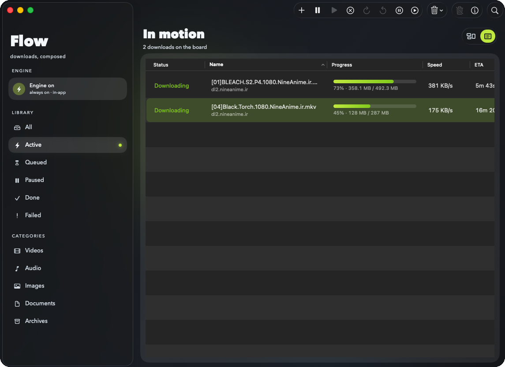
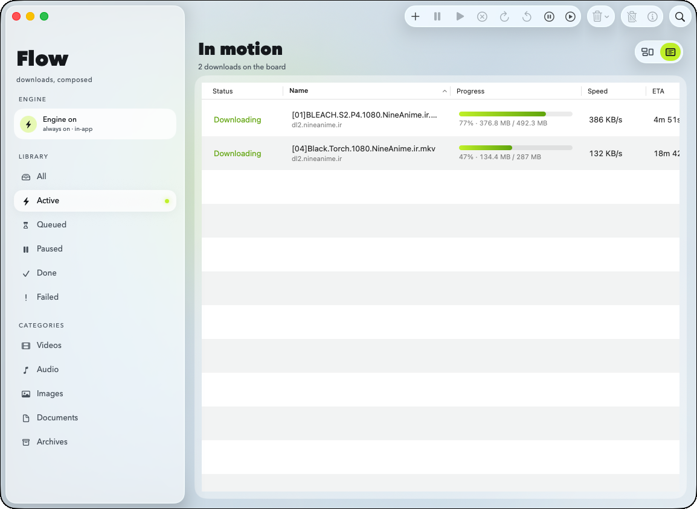

# Flow Download Manager

**A native macOS download manager for Apple Silicon — fast segmented transfers, a background engine that keeps going, and a UI that doesn’t feel like 2009.**

[](LICENSE)
[](#requirements)
[](#requirements)

Flow is free, open source, and distributed from GitHub. No Mac App Store tax. No subscription. Community builds ship **unsigned / ad-hoc** by design ([ADR 0008](Documentation/adr/0008-community-github-distribution.md)) — same model many serious open-source Mac tools use.

<p align="center">
  
  &nbsp;
  
</p>

---

## Install in one line

Apple Silicon · macOS 14+:

```bash
curl -fsSL https://raw.githubusercontent.com/sina-parsania/flow-download-manager/main/Scripts/install.sh | bash
```

That downloads the latest GitHub Release DMG, installs **Flow Download Manager** into `~/Applications`, clears Gatekeeper quarantine, and launches the app.

Options:

```bash
# System-wide Applications (may prompt for admin)
curl -fsSL https://raw.githubusercontent.com/sina-parsania/flow-download-manager/main/Scripts/install.sh | bash -s -- --system

# Pin a tag
curl -fsSL https://raw.githubusercontent.com/sina-parsania/flow-download-manager/main/Scripts/install.sh | bash -s -- --tag v0.3.4

# Install without launching
curl -fsSL https://raw.githubusercontent.com/sina-parsania/flow-download-manager/main/Scripts/install.sh | bash -s -- --no-open
```

Full Gatekeeper notes: [Documentation/install-from-github.md](Documentation/install-from-github.md).

---

## Why Flow

| | |
| --- | --- |
| **Native stack** | SwiftUI + a dedicated `DownloadEngineAgent` over authenticated XPC — the UI never owns sockets or partial files. |
| **Transfers that resume** | Segmented HTTP(S) with validator-bound `.segmap` resume; relaunch doesn’t throw progress away or stitch a changed resource. |
| **Resilient on bad links** | Stall-aware retries, jittered backoff, hedged tail (losing replica cancelled), optional per-host connection/speed/UA/credential overrides. |
| **Background by design** | Engine stays available while Flow is open (app-scoped XPC on ad-hoc builds; LaunchAgent path for signed installs). |
| **Board-first UI** | Pin cards, inspector, projects & tags — built for people who live in a download queue. |
| **Browser companion** | Chrome and Firefox MV3 extensions sharing one embedded native messaging host. Safari is developer-only until signed. |
| **Honest licensing** | GPL-3.0-or-later. Build it, fork it, ship improvements back. |

---

## Requirements

- macOS **14.0+**
- Apple Silicon (**arm64** only)
- For building: Xcode 15+

---

## Quick start (from source)

```bash
git clone https://github.com/sina-parsania/flow-download-manager.git
cd flow-download-manager
make bootstrap-tools
make verify-fast
open .build/DerivedData/Build/Products/Debug/DownloadManager.app
```

---

## Build an unsigned release package

```bash
make release-sbom
make release-dmg-unsigned
```

Artifacts land under `Artifacts/release/` (DMG + SHA-256). Optional Developer ID path for maintainers who already have credentials:

```bash
DM_CODESIGN_IDENTITY='Developer ID Application: …' make release-codesign APP=/path/to/DownloadManager.app
make release-notarize DMG=/path/to/signed.dmg
```

Both scripts **fail closed** without credentials — that is expected for community releases, not a broken gate. See [Documentation/release-checklist.md](Documentation/release-checklist.md).

---

## Architecture (short)

```
Flow.app  ──XPC──►  DownloadEngineAgent
   UI / SwiftUI         sole DB writer, transfers, queue
```

Layering is strict: `Domain` → `XPCContracts` → `Persistence` / `EngineAgent` / `Presentation`. See `AGENTS.md` and `Documentation/adr/`.

---

## Status

**v0.3.4** is the current documented release — per-job paths and download timeline in the library, Open File, CI tooling pins, plus transfer/probe hardening from 0.3.3. See [CHANGELOG.md](CHANGELOG.md).

Still evolving / deferred by ADR: VoiceOver pass, libtorrent (magnets stay unsupported), bundled yt-dlp without checksummed VendorBuild manifests, signed Safari extension, optional notarization.

---

## License

GPL-3.0-or-later. See [`LICENSE`](LICENSE).

---

## Security & privacy

- Processing is **local**. No telemetry in the community build.
- Prefer verifying Release checksums (`*.dmg.sha256`) or building from a reviewed commit.
- Report issues via GitHub; see [`SECURITY.md`](SECURITY.md).
